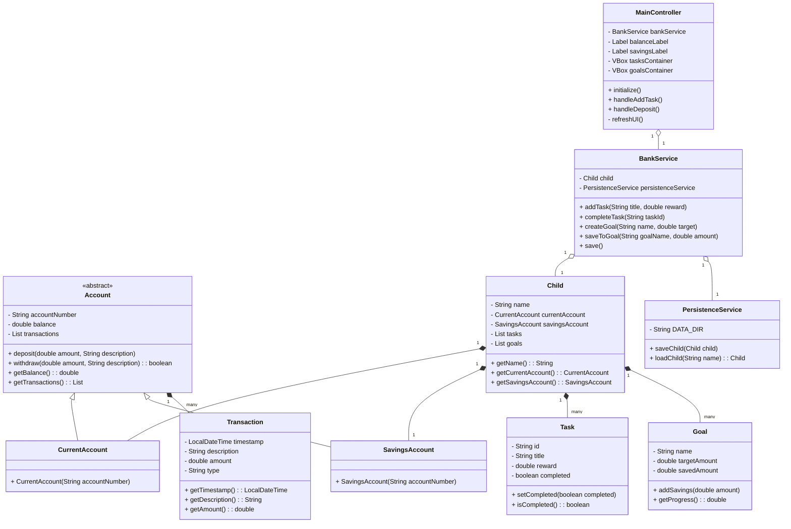

# UML Class Diagram: Virtual Bank for Kids

```mermaid
classDiagram
    class Account {
        <<abstract>>
        - String accountNumber
        - double balance
        - List<Transaction> transactions
        + deposit(double amount, String description)
        + withdraw(double amount, String description): boolean
        + getBalance(): double
        + getTransactions(): List<Transaction>
    }

    class CurrentAccount {
        + CurrentAccount(String accountNumber)
    }

    class SavingsAccount {
        + SavingsAccount(String accountNumber)
    }

    class Transaction {
        - LocalDateTime timestamp
        - String description
        - double amount
        - String type
        + getTimestamp(): LocalDateTime
        + getDescription(): String
        + getAmount(): double
    }

    class Task {
        - String id
        - String title
        - double reward
        - boolean completed
        + setCompleted(boolean completed)
        + isCompleted(): boolean
    }

    class Goal {
        - String name
        - double targetAmount
        - double savedAmount
        + addSavings(double amount)
        + getProgress(): double
    }

    class Child {
        - String name
        - CurrentAccount currentAccount
        - SavingsAccount savingsAccount
        - List<Task> tasks
        - List<Goal> goals
        + getName(): String
        + getCurrentAccount(): CurrentAccount
        + getSavingsAccount(): SavingsAccount
    }

    class BankService {
        - Child child
        - PersistenceService persistenceService
        + addTask(String title, double reward)
        + completeTask(String taskId)
        + createGoal(String name, double target)
        + saveToGoal(String goalName, double amount)
        + save()
    }

    class PersistenceService {
        - String DATA_DIR
        + saveChild(Child child)
        + loadChild(String name): Child
    }

    class MainController {
        - BankService bankService
        - Label balanceLabel
        - Label savingsLabel
        - VBox tasksContainer
        - VBox goalsContainer
        + initialize()
        + handleAddTask()
        + handleDeposit()
        - refreshUI()
    }

    Account <|-- CurrentAccount
    Account <|-- SavingsAccount
    Account "1" *-- "many" Transaction
    Child "1" *-- "1" CurrentAccount
    Child "1" *-- "1" SavingsAccount
    Child "1" *-- "many" Task
    Child "1" *-- "many" Goal
    BankService "1" o-- "1" Child
    BankService "1" o-- "1" PersistenceService
    MainController "1" o-- "1" BankService
```
